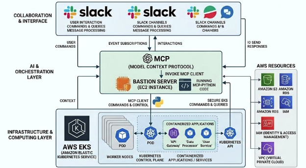
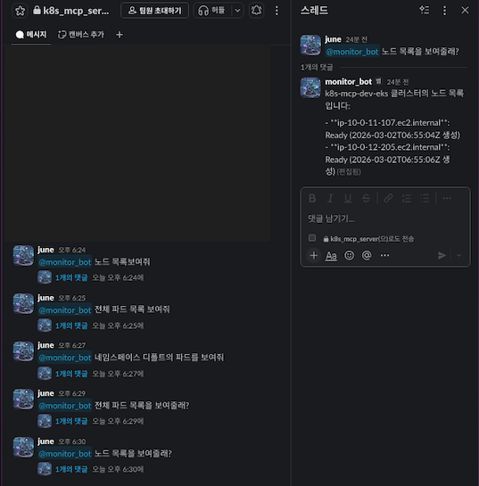

Cloud / DevOps Engineer

AWS 및 온프레미스 환경에서 클라우드 관리업무 담당한 DevOps 엔지니어입니다.  
Terraform, GitLab, ArgoCD를 통한 IaC 및 GitOps 기반 배포 자동화를 구현하고,  
Grafana, Prometheus, Datadog을 이용한 모니터링 고도화 및 비용 효율화 구조를 운영 중입니다.

차후 Mlops 엔지니어의 업무 담당 할 수 있도록 준비중이며 최근에 많이 사용되는
Kserve,Kubeflow,Mlfow,Mcp,AgentAI 개발 공부도 진행중입니다. 

## Git 
현재 git의 주요 내용은 스킬 및 개인 성장을 위해 공부한 내역입니다.

---

##  Skills & Tools

| 분야 | 기술 |
|------|------|
| **Cloud / Infra** | AWS (EKS, EC2, RDS, S3, CloudFront, CloudWatch), VxRail, Fortigate |
| **IaC / Automation** | Terraform, Helm, ArgoCD, GitLab CI/CD |
| **Monitoring** | Grafana, Prometheus, Loki, Datadog |
| **Data Infra** | Airflow (EKS), Kafka Connect, CDC Pipeline |
| **FinOps / Cost Optimization** | AWS Graviton Migration, Resource Rightsizing |
| **Security / Networking** | Cloudflare, IAM, VPN, Route53 |
| **AI / Mlops** | Kserve,Kubeflow,Mlfow,Mcp,Agent AI 개인프로젝트 수준의 기술 (실무 x)|

---

##  Projects & Works 실무

### Cloud Infra & DevOps Automation 
- AWS 및 온프레미스 하이브리드 인프라 운영 (EKS, Terraform, GitOps)
- ArgoCD 기반 배포 자동화
- Grafana + Loki + Prometheus + Datadog 통합 모니터링 구축  

### 📊 Data Lake (CDC Project)
- 데이터 엔지니어와 협업하여 datalake 환경 구축 작업
- 로그 수집, 적재, 모니터링 자동화 구현

### 📊 온프레미스 CI / CD  k8s 구축 
- dev 환경을 온프레미스 자체 구축 작업진행

##  개인 프로젝트 

### 📊 mcp server & eks & slack

구조도

- AWS EKS , Bastion server Terraform 구성 후 배포
- Bastion 서버에서 mcp-server_eks/slack 프로젝트 생성 후 실행
- 프로젝트의 목적은 eks 상태 모니터링 및 slack 채널 통해서 생성 및 관리 목적
- model - gemini flash 
- 차후 LGTM , CI / CD 적용 예정

### slack 통해서 명령 전달 

