## 아키텍처
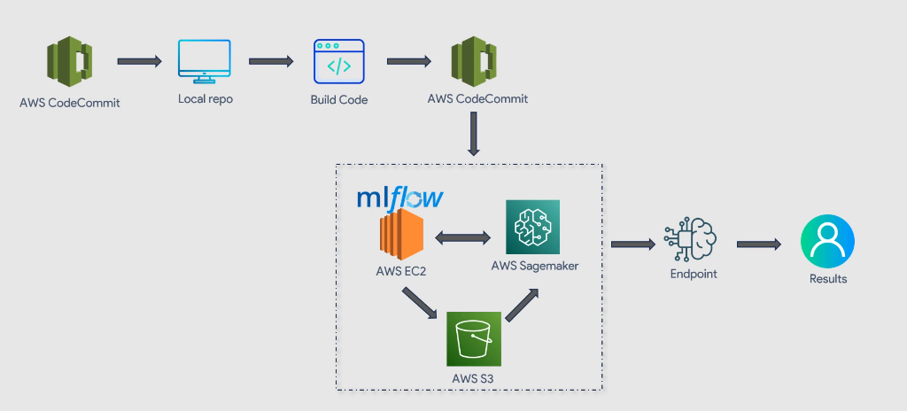

## ec2 생성 후 

apt update 

apt install python3-pip

pip3 install pipenv virtualenv

mkdir mlflow

cd mlflow

pipenv install mlflow awscli boto3 setuptools

aws configure 

mlflow server -h 0.0.0.0 --backend-store-uri sqlite:///mlflow.db --default-artifact-root s3://mlflow-artifacts

## sagemaker 생성

레포 연결 
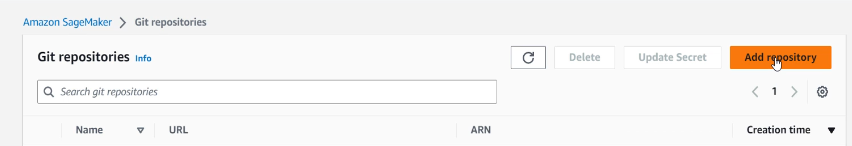
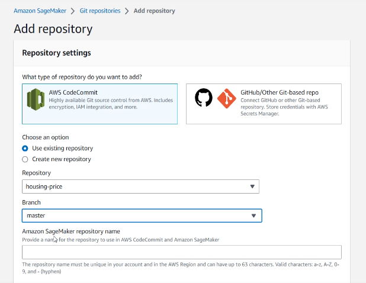

노트북 생성
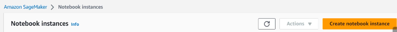
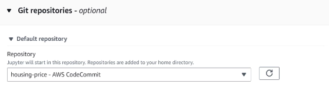

주피터랩 
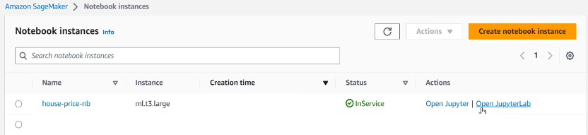

터미널에서 mlflow 설치 및 python run.py
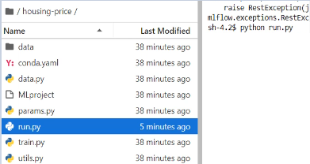

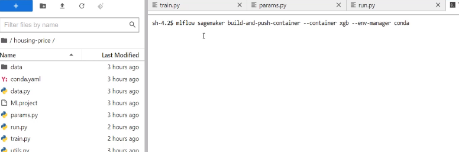

## deploy

python deploy.py 실행

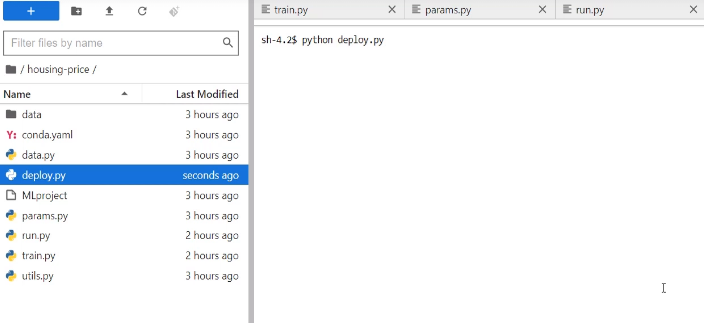

엔드포인트 생성됨
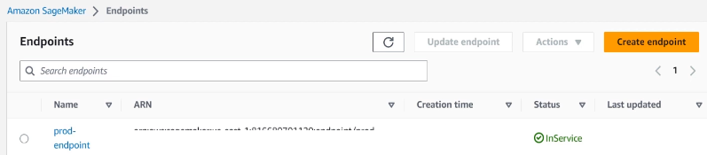

테스트 실행
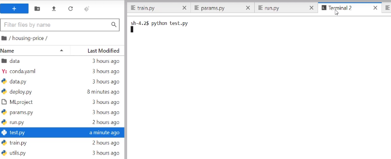